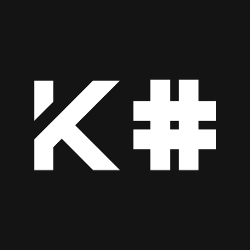

<h1 align="center">k-sharp</h1>

<h3 align="center">K# is a programing language that has similar syntax to c and transpiles to python</h3>

## Install
- Make sure you have python3.12 or later
- `python3 install.py`

## Using it

`ksharp init`
`ksharp install`
`ksharp build`

## OOP

This programing lanaguage isn't meant to be too much Object Oriented like Java or Python. it's more like c/c++ ish where you focus on variables, structs, and functions, classes are last
